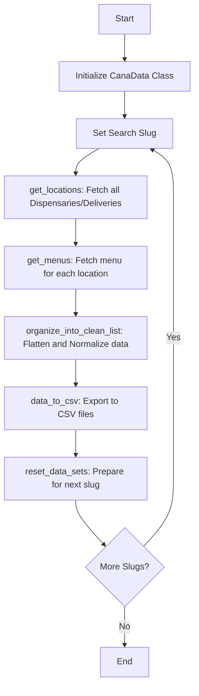

# CanaData Architecture and Logic Documentation

This document provides a high-level overview of how the **CanaData** scraper works, its data architecture, and the logic flow of its core components.

---

## 1. High-Level Workflow

The scraper follows a linear sequential workflow for each city or state "slug" provided:



---

## 2. Core Logic Components

### A. Location Retrieval (`get_locations`)
- **API Endpoint**: `https://api-g.weedmaps.com/discovery/v1/listings`
- **Logic**: 
    - Uses a `while True` loop to handle pagination.
    - Each request fetches 100 listings (the max allowed per page).
    - Uses `offset` to move to the next page (`0, 100, 200, ...`).
    - Filters are applied for `storefront` (dispensaries) and `delivery` based on user settings.
    - Captures the total count of listings from the first response (`meta.total_listings`).

### B. Menu Retrieval (`get_menus`)
- **API Endpoint**: `https://weedmaps.com/api/web/v1/listings/{slug}/menu`
- **Logic**:
    - Iterates through the list of location slugs collected in the previous step.
    - Fetches the full hierarchical menu for each location.
    - Enriches each menu item with parent location metadata (URL, listing ID, etc.).
    - Handles "empty menus" (locations with no items) by logging the listing but skipping the item loop.

### D. Data Flattening (`flatten_dictionary`)
- **Challenge**: Weedmaps menu data is deeply nested (e.g., `item -> price -> amount` or `item -> images -> small -> url`).
- **Solution**: A custom **iterative stack-based algorithm** that converts nested dictionaries into a single level.
- **Result**: Keys are joined by dots (e.g., `price.amount`) making the data suitable for a flat CSV format.

### E. Normalization (`organize_into_clean_list`)
- Since different items can have different attributes (e.g., some have THC percentages, others don't), the scraper:
    1. Scans all flattened items to find Every possible key.
    2. Updates every individual item to include every key.
    3. Fills missing values with `"None"`.
- This ensures the CSV columns align perfectly across thousands of rows.

---

## 3. Remote Integrations

### Leafly (`LeaflyScraper.py`)
- **Method**: Uses the **Apify** platform to scrape data, as Leafly has strong anti-bot protections.
- **Flow**:
    1. Triggers a remote Actor run via `apify_client`.
    2. Waits for the run to complete.
    3. Downloads the dataset and integrates it into the `allMenuItems` structure.
- **Config**: Requires `APIFY_TOKEN` in `.env`.

### CannMenus (`CannMenusClient.py`)
- **Method**: Direct API integration for standardized e-commerce data.
- **Flow**:
    1. Fetches a list of retailers for a state.
    2. Iterates through retailers to fetch their normalized menus.
- **Config**: Requires `CANNMENUS_API_TOKEN` in `.env`.

---

## 4. Reporting Engine (`generate_report.py`)

- **Purpose**: Transforms raw JSON data from Weedmaps into a human-readable, interactive HTML dashboard.
- **Design**: Uses a "Glassmorphism" aesthetic with neon accents and blurry backgrounds.
- **Features**:
    - **Responsive Grid**: Adapts to mobile and desktop screens.
    - **Visual Indicators**: Badges for "Open Now", rating, and promos.
    - **Self-Contained**: The CSS is embedded directly in the HTML, producing a single portable file.

---

## 5. Data Structures

### `self.locations`
A list of simple dictionaries containing the bare essentials for fetching menus:
```python
[{'slug': 'example-dispensary-1', 'type': 'dispensary'}, ...]
```

### `self.allMenuItems`
A dictionary where keys are Listing IDs and values are lists of raw menu items:
```python
{
    '12345': [{'name': 'Blue Dream', ...}, {'name': 'OG Kush', ...}],
}
```

### `self.finishedMenuItems`
The final flattened and normalized list of dictionaries ready for CSV output.

---

## 6. Error Handling and Resiliency

- **Rate Limiting**: If an API call fails or returns a 422, the script attempts to inform the user and provides a retry/skip mechanism.
- **503 Errors**: Specifically handled in `get_menus` as "First Byte Errors" (common when Weedmaps is under high load or blocks automated traffic).
- **Graceful Termination**: Checks if a state has zero results (`meta.total_listings == 0`) and adds it to `empty_states` to avoid wasted processing.

---

## 7. File Outputs

The script creates a directory named `CanaData_MM-DD-YYYY` containing:
1. `[slug]_results.csv`: Detailed item-by-item menu data.
2. `[slug]_total_listings.csv`: High-level information about every location found.
3. `all_brands.csv` / `all_strains.csv`: Global metadata exports (if requested).
4. `listing_report.html`: Visual HTML report for the searched region.

## 8. Performance Features

### Concurrent Processing
The script now supports concurrent processing of multiple locations using `ThreadPoolExecutor`. This can significantly reduce scraping time for areas with many locations.

Configuration options:
- `MAX_WORKERS`: Number of concurrent threads (default: 10)
- `RATE_LIMIT`: Minimum delay between requests in seconds (default: 1.0)

### Caching
Multi-tier caching reduces redundant API calls:
- Memory cache with TTL (default: 1 hour)
- Disk cache for persistence across runs (default: 6 hours)
- Configurable through `CACHE_ENABLED`, `CACHE_TTL`, and `DISK_CACHE_TTL`

### Optimized Data Processing
Data flattening is now optimized using pandas `json_normalize` when available, with fallback to the custom algorithm for edge cases.

Configuration options:
- `OPTIMIZE_PROCESSING`: Enable/disable optimized processing (default: true)
- `PROCESSING_MAX_WORKERS`: Workers for fallback processing (default: 4)

---

*For usage instructions, please refer to the [README.md](./README.md).*
