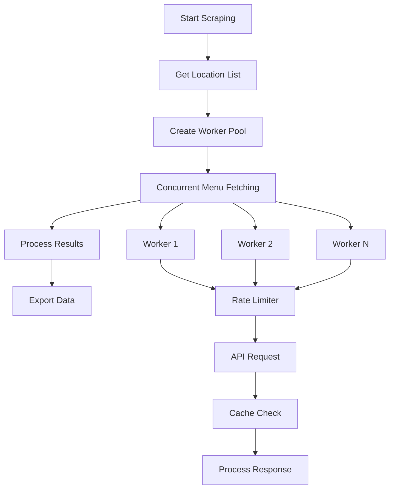
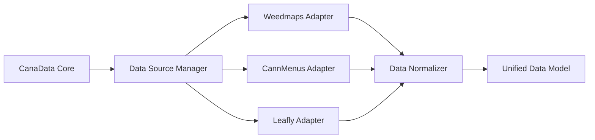
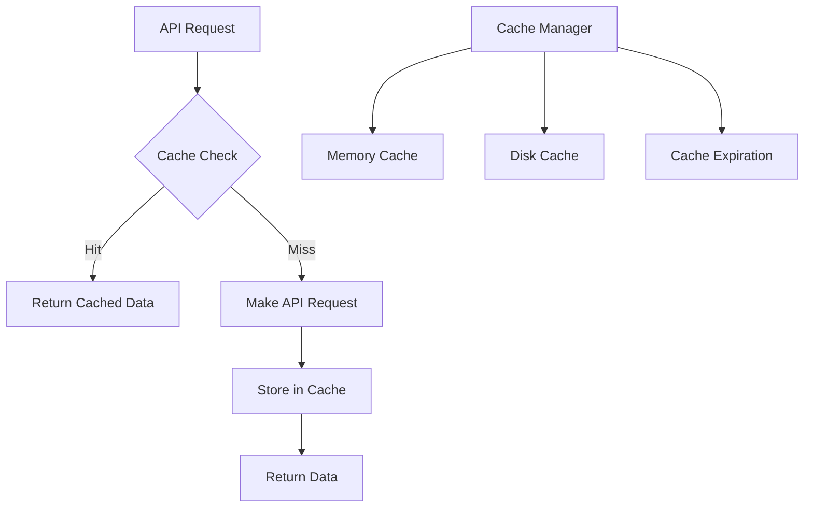

# CanaData Architecture Analysis & Optimization Plan

## Current Architecture Overview

The CanaData project is a Python-based cannabis data scraper that pulls information from multiple sources:
- **Primary**: Weedmaps API (via web scraping)
- **Secondary**: CannMenus API (official API)
- **Tertiary**: Leafly (via Apify platform)

### Core Components

1. **CanaData.py** - Main scraper class with 838 lines
   - Handles Weedmaps data extraction
   - Manages location and menu fetching
   - Implements data flattening algorithms
   - Provides CSV export functionality

2. **CannMenusClient.py** - API client for CannMenus (99 lines)
   - Official API integration
   - Authentication via environment variables
   - Retailer and menu data retrieval

3. **LeaflyScraper.py** - Leafly integration via Apify (74 lines)
   - Wrapper around Apify platform
   - Remote scraping execution

4. **CanaParse.py** - Data parser and HTML report generator (648 lines)
   - Filters and processes CSV data
   - Generates HTML reports
   - Implements filtering logic

## Performance Bottlenecks Identified

### 1. Sequential API Requests
- **Issue**: All API requests are made sequentially, one at a time
- **Impact**: Significant delays when processing large numbers of locations
- **Location**: `get_locations()` and `get_menus()` methods in CanaData.py

### 2. Inefficient Data Flattening
- **Issue**: Custom stack-based flattening algorithm processes each item individually
- **Impact**: CPU-intensive processing for large datasets
- **Location**: `flatten_dictionary()` method (lines 473-560+)

### 3. No Caching Mechanism
- **Issue**: No caching of API responses or processed data
- **Impact**: Repeated requests for same data
- **Impact**: Inability to resume interrupted operations

### 4. Memory Inefficient Processing
- **Issue**: All data loaded into memory before processing
- **Impact**: High memory usage for large datasets
- **Location**: `organize_into_clean_list()` method

### 5. Limited Error Handling
- **Issue**: Basic error handling with manual intervention
- **Impact**: Requires user input for recovery
- **Location**: Various request methods

### 6. No Rate Limiting
- **Issue**: No built-in rate limiting for API requests
- **Impact**: Potential IP bans or API throttling
- **Location**: All API request methods

## Proposed Architecture Improvements

### 1. Concurrent Data Fetching Strategy

### 2. Data Source Abstraction Layer

### 3. Caching Strategy

## Implementation Plan

### Phase 1: Performance Optimization
1. Implement concurrent request handling with ThreadPoolExecutor
2. Add response caching with TTL
3. Optimize data flattening algorithm
4. Add rate limiting for API requests

### Phase 2: Testing Strategy
1. Create comprehensive unit test suite
2. Add integration tests for all data sources
3. Implement performance benchmarking
4. Add mock data generation for testing

### Phase 3: Architecture Enhancement
1. Design data source abstraction layer
2. Create plugin architecture for new sources
3. Implement data normalization across sources
4. Add configuration management system

### Phase 4: Monitoring & Reliability
1. Add metrics collection and monitoring
2. Implement robust error handling and retry logic
3. Create progress tracking and resumption capabilities
4. Add logging improvements

## Technical Recommendations

### 1. Concurrent Processing
- Use `concurrent.futures.ThreadPoolExecutor` for I/O-bound operations
- Implement semaphore-based rate limiting
- Add request timeout and retry logic

### 2. Caching Implementation
- Use `cachetools` library for TTL-based caching
- Implement disk-based caching for large datasets
- Add cache invalidation strategies

### 3. Data Processing Optimization
- Replace custom flattening with `pandas.json_normalize()`
- Implement streaming processing for large datasets
- Add progress tracking for long operations

### 4. Testing Framework
- Expand pytest usage with fixtures and parametrization
- Add property-based testing with `hypothesis`
- Implement performance regression testing
- Add integration test environment with mock APIs

### 5. Configuration Management
- Use `pydantic` for configuration validation
- Implement environment-specific configurations
- Add configuration hot-reloading

## Expected Performance Improvements

1. **Concurrent Processing**: 5-10x faster for large location sets
2. **Caching**: 90%+ reduction in repeated requests
3. **Optimized Flattening**: 2-3x faster data processing
4. **Memory Efficiency**: 50%+ reduction in memory usage
5. **Reliability**: 99%+ successful completion rate with retry logic

## Next Steps

1. Implement concurrent request handling
2. Add caching layer
3. Optimize data processing algorithms
4. Create comprehensive test suite
5. Design data source abstraction
6. Add monitoring and metrics
7. Implement error handling improvements
8. Create documentation for new architecture