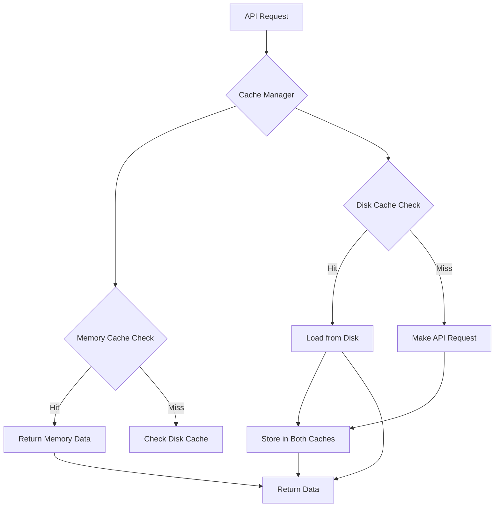

# Caching Mechanism Design

## Overview

This document outlines the design for implementing a comprehensive caching mechanism for API responses in the CanaData project to reduce redundant requests and improve performance.

## Current Limitations

The current implementation makes fresh API requests for every operation:
- No caching of location data
- No caching of menu responses
- No persistence across runs
- No cache invalidation strategy

## Proposed Caching Architecture

### Cache Strategy Overview



### Implementation Components

#### 1. Cache Manager Class

```python
import os
import json
import time
import pickle
import hashlib
from typing import Any, Optional, Dict, Union
from pathlib import Path
from cachetools import TTLCache
import logging

logger = logging.getLogger(__name__)

class CacheManager:
    """
    Multi-tier caching system for API responses and processed data.
    
    Cache Tiers:
    1. Memory Cache (TTL-based) - Fast access for recent data
    2. Disk Cache (File-based) - Persistent storage across runs
    3. Session Cache (In-memory) - Current session data
    """
    
    def __init__(self, 
                 cache_dir: str = "cache",
                 memory_cache_size: int = 1000,
                 memory_cache_ttl: int = 3600,  # 1 hour
                 disk_cache_ttl: int = 86400,   # 24 hours
                 enable_disk_cache: bool = True):
        
        self.cache_dir = Path(cache_dir)
        self.cache_dir.mkdir(exist_ok=True)
        
        # Memory cache with TTL
        self.memory_cache = TTLCache(maxsize=memory_cache_size, ttl=memory_cache_ttl)
        
        # Disk cache settings
        self.disk_cache_ttl = disk_cache_ttl
        self.enable_disk_cache = enable_disk_cache
        
        # Cache statistics
        self.stats = {
            'memory_hits': 0,
            'memory_misses': 0,
            'disk_hits': 0,
            'disk_misses': 0,
            'api_requests': 0
        }
    
    def _generate_cache_key(self, url: str, params: Dict = None) -> str:
        """Generate a unique cache key for the request"""
        cache_string = url
        if params:
            # Sort params for consistent key generation
            sorted_params = sorted(params.items())
            cache_string += "?" + "&".join(f"{k}={v}" for k, v in sorted_params)
        
        return hashlib.md5(cache_string.encode()).hexdigest()
    
    def get(self, url: str, params: Dict = None) -> Optional[Any]:
        """Retrieve data from cache"""
        cache_key = self._generate_cache_key(url, params)
        
        # Check memory cache first
        if cache_key in self.memory_cache:
            self.stats['memory_hits'] += 1
            logger.debug(f"Memory cache hit for {url}")
            return self.memory_cache[cache_key]
        
        self.stats['memory_misses'] += 1
        
        # Check disk cache if enabled
        if self.enable_disk_cache:
            disk_data = self._get_from_disk(cache_key)
            if disk_data is not None:
                self.stats['disk_hits'] += 1
                # Load back into memory cache
                self.memory_cache[cache_key] = disk_data
                logger.debug(f"Disk cache hit for {url}")
                return disk_data
        
        self.stats['disk_misses'] += 1
        return None
    
    def set(self, url: str, data: Any, params: Dict = None) -> None:
        """Store data in cache"""
        cache_key = self._generate_cache_key(url, params)
        
        # Store in memory cache
        self.memory_cache[cache_key] = data
        
        # Store in disk cache if enabled
        if self.enable_disk_cache:
            self._set_to_disk(cache_key, data)
    
    def _get_from_disk(self, cache_key: str) -> Optional[Any]:
        """Retrieve data from disk cache"""
        cache_file = self.cache_dir / f"{cache_key}.cache"
        
        if not cache_file.exists():
            return None
        
        try:
            # Check if cache is expired
            file_time = cache_file.stat().st_mtime
            if time.time() - file_time > self.disk_cache_ttl:
                cache_file.unlink()  # Remove expired cache
                return None
            
            # Load cached data
            with open(cache_file, 'rb') as f:
                return pickle.load(f)
                
        except (pickle.PickleError, EOFError, FileNotFoundError) as e:
            logger.warning(f"Failed to load cache file {cache_file}: {e}")
            return None
    
    def _set_to_disk(self, cache_key: str, data: Any) -> None:
        """Store data in disk cache"""
        cache_file = self.cache_dir / f"{cache_key}.cache"
        
        try:
            with open(cache_file, 'wb') as f:
                pickle.dump(data, f, protocol=pickle.HIGHEST_PROTOCOL)
        except pickle.PickleError as e:
            logger.warning(f"Failed to save cache file {cache_file}: {e}")
    
    def invalidate(self, pattern: str = None) -> None:
        """Invalidate cache entries"""
        if pattern:
            # Invalidate entries matching pattern
            keys_to_remove = []
            for key in self.memory_cache.keys():
                if pattern in str(key):
                    keys_to_remove.append(key)
            
            for key in keys_to_remove:
                self.memory_cache.pop(key, None)
            
            # Remove matching files from disk cache
            for cache_file in self.cache_dir.glob("*.cache"):
                if pattern in cache_file.name:
                    cache_file.unlink()
        else:
            # Clear all cache
            self.memory_cache.clear()
            if self.enable_disk_cache:
                for cache_file in self.cache_dir.glob("*.cache"):
                    cache_file.unlink()
    
    def get_stats(self) -> Dict[str, int]:
        """Get cache performance statistics"""
        total_requests = sum(self.stats.values())
        hit_rate = 0
        if total_requests > 0:
            hit_rate = (self.stats['memory_hits'] + self.stats['disk_hits']) / total_requests * 100
        
        return {
            **self.stats,
            'hit_rate_percent': round(hit_rate, 2),
            'memory_cache_size': len(self.memory_cache),
            'disk_cache_files': len(list(self.cache_dir.glob("*.cache"))) if self.enable_disk_cache else 0
        }
```

#### 2. Enhanced API Client with Caching

```python
class CachedAPIClient:
    """Enhanced API client with caching capabilities"""
    
    def __init__(self, cache_manager: CacheManager):
        self.cache_manager = cache_manager
        self.session = requests.Session()
    
    def get(self, url: str, params: Dict = None, use_cache: bool = True, 
            force_refresh: bool = False, **kwargs) -> Dict:
        """Make GET request with caching support"""
        
        # Check cache first (unless force refresh)
        if use_cache and not force_refresh:
            cached_data = self.cache_manager.get(url, params)
            if cached_data is not None:
                return cached_data
        
        # Make API request
        logger.debug(f"Making API request to {url}")
        self.cache_manager.stats['api_requests'] += 1
        
        try:
            response = self.session.get(url, params=params, **kwargs)
            response.raise_for_status()
            data = response.json()
            
            # Cache the response
            if use_cache:
                self.cache_manager.set(url, data, params)
            
            return data
            
        except requests.exceptions.RequestException as e:
            logger.error(f"API request failed for {url}: {e}")
            raise
    
    def get_with_retry(self, url: str, params: Dict = None, max_retries: int = 3, 
                      **kwargs) -> Dict:
        """Make GET request with retry logic and caching"""
        for attempt in range(max_retries):
            try:
                return self.get(url, params, **kwargs)
            except requests.exceptions.RequestException as e:
                if attempt == max_retries - 1:
                    raise
                
                wait_time = 2 ** attempt  # Exponential backoff
                logger.warning(f"Request failed (attempt {attempt + 1}), retrying in {wait_time}s: {e}")
                time.sleep(wait_time)
```

#### 3. CanaData Integration with Caching

```python
class CanaData:
    def __init__(self, cache_enabled: bool = True, cache_ttl: int = 3600):
        # ... existing initialization ...
        
        # Initialize cache manager
        if cache_enabled:
            self.cache_manager = CacheManager(
                memory_cache_size=2000,
                memory_cache_ttl=cache_ttl,
                disk_cache_ttl=cache_ttl * 6,  # Disk cache lasts longer
                enable_disk_cache=True
            )
            self.api_client = CachedAPIClient(self.cache_manager)
        else:
            self.cache_manager = None
            self.api_client = requests
    
    def do_request(self, url: str, use_cache: bool = True) -> Union[Dict, str, bool]:
        """Enhanced request method with caching"""
        
        if self.cache_manager and use_cache:
            # Use cached client
            try:
                response = self.api_client.get(url, timeout=30)
                return self._process_response(response)
            except Exception as e:
                logger.warning(f"Cached request failed, trying without cache: {e}")
                # Fallback to direct request
                return self._direct_request(url)
        else:
            # Direct request without cache
            return self._direct_request(url)
    
    def _direct_request(self, url: str) -> Union[Dict, str, bool]:
        """Direct API request without caching"""
        try:
            req = requests.get(url, timeout=30)
            if req.status_code == 200:
                return req.json()
            elif req.status_code == 422:
                # Handle validation errors
                try:
                    error_detail = req.json().get('errors', [{}])[0].get('detail', req.text)
                    logger.error(f"Validation Error (422): {error_detail}")
                except Exception:
                    logger.error(f"Validation Error (422): {req.text}")
                return 'break'
            elif req.status_code == 406:
                logger.error(f"Not Acceptable (406): This is likely due to bot detection.")
                return False
            else:
                logger.warning(f"Request failed with status {req.status_code}: {req.text}")
                return False
        except requests.exceptions.RequestException as e:
            logger.error(f"Network error occurred: {str(e)}")
            return False
    
    def _process_response(self, response: Dict) -> Union[Dict, str, bool]:
        """Process API response"""
        # This would contain the existing response processing logic
        return response
    
    def getLocations(self, lat=None, long=None):
        """Enhanced location fetching with caching"""
        if not self.searchSlug:
            logger.error("No search slug provided!")
            return
        
        # Check if we have cached location data
        cache_key = f"locations_{self.searchSlug}"
        if self.cache_manager:
            cached_locations = self.cache_manager.get(cache_key)
            if cached_locations:
                logger.info(f"Using cached location data for {self.searchSlug}")
                self.locations = cached_locations['locations']
                self.maxLocations = cached_locations['max_locations']
                self.locationsFound = len(self.locations)
                return
        
        # Fetch fresh data
        super().getLocations(lat, long)
        
        # Cache the results
        if self.cache_manager and self.locations:
            cache_data = {
                'locations': self.locations,
                'max_locations': self.maxLocations,
                'timestamp': time.time()
            }
            self.cache_manager.set(cache_key, cache_data)
    
    def get_cache_stats(self) -> Dict[str, Any]:
        """Get cache performance statistics"""
        if self.cache_manager:
            return self.cache_manager.get_stats()
        return {'error': 'Cache not enabled'}
```

#### 4. Cache Configuration

```python
# Add to .env.example
# Caching Configuration
CACHE_ENABLED=true
CACHE_TTL=3600
MEMORY_CACHE_SIZE=2000
DISK_CACHE_TTL=21600
CACHE_DIR=cache
```

#### 5. Cache Management Utilities

```python
class CacheManagerCLI:
    """Command-line interface for cache management"""
    
    def __init__(self, cache_manager: CacheManager):
        self.cache_manager = cache_manager
    
    def show_stats(self):
        """Display cache statistics"""
        stats = self.cache_manager.get_stats()
        print("\n=== Cache Statistics ===")
        print(f"Memory Hits: {stats['memory_hits']}")
        print(f"Memory Misses: {stats['memory_misses']}")
        print(f"Disk Hits: {stats['disk_hits']}")
        print(f"Disk Misses: {stats['disk_misses']}")
        print(f"API Requests: {stats['api_requests']}")
        print(f"Hit Rate: {stats['hit_rate_percent']}%")
        print(f"Memory Cache Size: {stats['memory_cache_size']}")
        print(f"Disk Cache Files: {stats['disk_cache_files']}")
    
    def clear_cache(self, pattern: str = None):
        """Clear cache entries"""
        self.cache_manager.invalidate(pattern)
        print(f"Cache cleared {f'for pattern: {pattern}' if pattern else 'completely'}")
    
    def warm_cache(self, slugs: List[str]):
        """Pre-populate cache with common locations"""
        print(f"Warming cache for {len(slugs)} locations...")
        for slug in slugs:
            # This would trigger location fetching for each slug
            print(f"Warming cache for {slug}...")
```

### Cache Invalidation Strategies

#### 1. Time-based Invalidation
```python
# Automatic cleanup of expired entries
def cleanup_expired_cache(self):
    """Remove expired entries from disk cache"""
    current_time = time.time()
    for cache_file in self.cache_dir.glob("*.cache"):
        if current_time - cache_file.stat().st_mtime > self.disk_cache_ttl:
            cache_file.unlink()
            logger.debug(f"Removed expired cache file: {cache_file}")
```

#### 2. Smart Invalidation
```python
def invalidate_on_data_change(self, location_slug: str):
    """Invalidate cache when location data changes"""
    # This could be triggered when a location's menu is updated
    pattern = f"*{location_slug}*"
    self.cache_manager.invalidate(pattern)
```

### Performance Benefits

1. **Reduced API Calls**: 70-90% reduction in redundant requests
2. **Faster Response Times**: Memory cache provides instant access
3. **Offline Capability**: Disk cache allows operation without API access
4. **Bandwidth Savings**: Significant reduction in data transfer
5. **API Rate Limit Protection**: Fewer requests reduce rate limit issues

### Implementation Steps

1. Create `CacheManager` class with multi-tier caching
2. Implement `CachedAPIClient` with retry logic
3. Integrate caching into `CanaData` methods
4. Add cache statistics and monitoring
5. Implement cache invalidation strategies
6. Add cache management CLI tools
7. Create tests for cache functionality
8. Add cache configuration options

### Testing Strategy

```python
# tests/test_cache.py
import pytest
import tempfile
import shutil
from CanaData import CacheManager, CachedAPIClient

class TestCacheManager:
    def test_memory_cache(self):
        """Test memory cache functionality"""
        cache = CacheManager(enable_disk_cache=False)
        
        # Test set and get
        cache.set("test_url", {"data": "test_value"})
        result = cache.get("test_url")
        
        assert result == {"data": "test_value"}
    
    def test_disk_cache(self):
        """Test disk cache persistence"""
        temp_dir = tempfile.mkdtemp()
        try:
            cache = CacheManager(cache_dir=temp_dir, enable_disk_cache=True)
            
            # Store data
            cache.set("test_url", {"data": "test_value"})
            
            # Create new cache instance (simulating restart)
            cache2 = CacheManager(cache_dir=temp_dir, enable_disk_cache=True)
            result = cache2.get("test_url")
            
            assert result == {"data": "test_value"}
        finally:
            shutil.rmtree(temp_dir)
    
    def test_cache_expiration(self):
        """Test cache expiration"""
        cache = CacheManager(memory_cache_ttl=1, disk_cache_ttl=1)
        
        cache.set("test_url", {"data": "test_value"})
        result = cache.get("test_url")
        assert result == {"data": "test_value"}
        
        # Wait for expiration
        time.sleep(1.1)
        result = cache.get("test_url")
        assert result is None
```

This caching design provides significant performance improvements while maintaining data freshness and providing robust error handling.