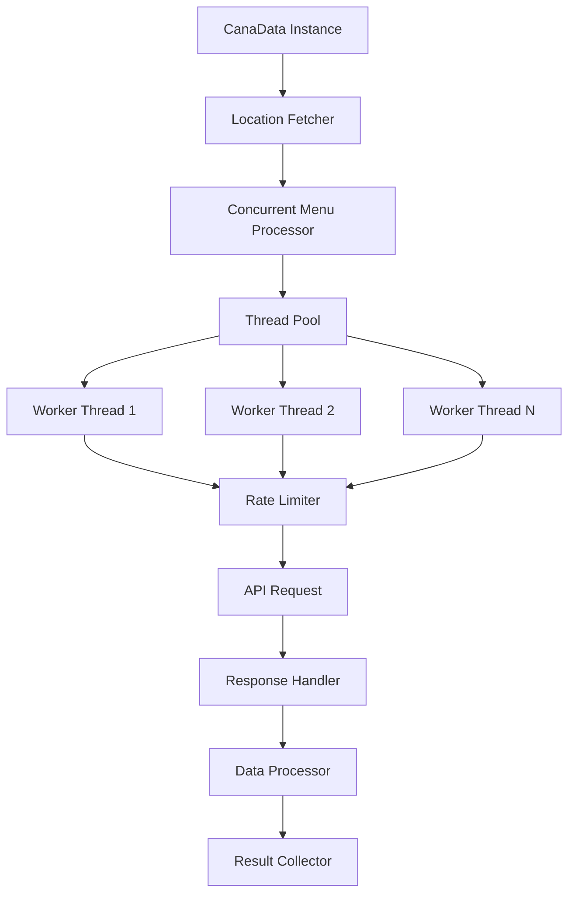

# Concurrent Data Fetching Design

## Overview

This document outlines the design for implementing concurrent data fetching in the CanaData project to significantly improve performance when scraping multiple locations.

## Current Limitations

The current implementation processes locations sequentially:
```python
# Current approach in getMenus()
for i, location in enumerate(self.locations):
    # Process one location at a time
    resp = requests.get(url, timeout=30)
    # Process response
```

This approach is inefficient because:
1. Network I/O is the bottleneck, not CPU processing
2. Each request waits for the previous one to complete
3. No rate limiting or request management
4. Poor error recovery

## Proposed Solution: Concurrent Fetching with ThreadPoolExecutor

### Architecture



### Implementation Components

#### 1. ConcurrentMenuProcessor Class

```python
import concurrent.futures
import threading
import time
from queue import Queue
from typing import List, Dict, Any, Callable

class ConcurrentMenuProcessor:
    def __init__(self, max_workers: int = 10, rate_limit: float = 1.0):
        self.max_workers = max_workers
        self.rate_limit = rate_limit  # Minimum seconds between requests
        self.semaphore = threading.Semaphore(max_workers)
        self.last_request_time = 0
        self.request_lock = threading.Lock()
        self.results = {}
        self.errors = []
        
    def process_locations(self, locations: List[Dict], process_func: Callable) -> Dict[str, Any]:
        """Process multiple locations concurrently"""
        with concurrent.futures.ThreadPoolExecutor(max_workers=self.max_workers) as executor:
            # Submit all tasks
            future_to_location = {
                executor.submit(self._process_single_location, location, process_func): location
                for location in locations
            }
            
            # Collect results as they complete
            for future in concurrent.futures.as_completed(future_to_location):
                location = future_to_location[future]
                try:
                    result = future.result()
                    self.results[location['slug']] = result
                except Exception as exc:
                    self.errors.append({
                        'location': location,
                        'error': str(exc)
                    })
                    logger.error(f"Location {location['slug']} generated an exception: {exc}")
        
        return self.results
    
    def _process_single_location(self, location: Dict, process_func: Callable) -> Any:
        """Process a single location with rate limiting"""
        with self.semaphore:
            # Rate limiting
            self._wait_for_rate_limit()
            
            # Process the location
            return process_func(location)
    
    def _wait_for_rate_limit(self):
        """Implement rate limiting between requests"""
        with self.request_lock:
            current_time = time.time()
            time_since_last = current_time - self.last_request_time
            
            if time_since_last < self.rate_limit:
                sleep_time = self.rate_limit - time_since_last
                time.sleep(sleep_time)
            
            self.last_request_time = time.time()
```

#### 2. Enhanced CanaData Integration

```python
class CanaData:
    def __init__(self, max_workers: int = 10, rate_limit: float = 1.0):
        # ... existing initialization ...
        self.concurrent_processor = ConcurrentMenuProcessor(max_workers, rate_limit)
    
    def getMenus(self):
        """Enhanced menu fetching with concurrent processing"""
        if self.NonGreenState:
            return
        
        logger.info(f"Processing {len(self.locations)} locations concurrently...")
        
        # Define the processing function for a single location
        def process_location_menu(location):
            return self._fetch_and_process_menu(location)
        
        # Process all locations concurrently
        results = self.concurrent_processor.process_locations(
            self.locations, 
            process_location_menu
        )
        
        # Update instance variables with results
        self.allMenuItems = results
        self.menuItemsFound = sum(len(menu) for menu in results.values())
        
        # Log any errors that occurred
        if self.concurrent_processor.errors:
            logger.warning(f"Encountered {len(self.concurrent_processor.errors)} errors during processing")
            for error in self.concurrent_processor.errors[:5]:  # Log first 5 errors
                logger.warning(f"Error for {error['location']['slug']}: {error['error']}")
        
        logger.info("Finished gathering menus. Organizing for export...")
        self.organize_into_clean_list()
    
    def _fetch_and_process_menu(self, location: Dict) -> List[Dict]:
        """Fetch and process menu for a single location"""
        location_slug = location["slug"]
        location_type = location["type"]
        
        try:
            url = f'https://weedmaps.com/api/web/v1/listings/{location_slug}/menu?type={location_type}'
            
            if self.testMode:
                logger.debug(f"Menu URL: {url}")
            
            resp = requests.get(url, timeout=30)
            
            if resp.status_code == 503:
                logger.warning(f"503 Service Unavailable for {location_slug}. Skipping.")
                return []
            
            if resp.status_code == 200:
                return self._process_menu_response(resp.json(), location)
            else:
                logger.error(f"Failed to fetch menu for {location_slug}: {resp.status_code}")
                return []
                
        except Exception as e:
            logger.error(f"Error processing {location_slug}: {str(e)}")
            return []
    
    def _process_menu_response(self, menu_json: Dict, location: Dict) -> List[Dict]:
        """Process menu response and extract items"""
        # This would contain the existing menu processing logic
        # extracted from the current process_menu_json method
        items = []
        
        # Extract categories and items from menu_json
        categories = menu_json.get('categories', [])
        for category in categories:
            category_items = category.get('items', [])
            for item in category_items:
                # Add location information to each item
                item['location_slug'] = location['slug']
                item['location_type'] = location['type']
                items.append(item)
        
        return items
```

#### 3. Configuration Management

```python
# Add to .env.example
# Concurrent Processing Configuration
MAX_WORKERS=10
RATE_LIMIT=1.0
REQUEST_TIMEOUT=30
MAX_RETRIES=3
RETRY_DELAY=1.0
```

#### 4. Error Handling and Retry Logic

```python
import random
from functools import wraps

def retry_with_backoff(max_retries=3, base_delay=1.0, max_delay=60.0):
    """Decorator for retrying requests with exponential backoff"""
    def decorator(func):
        @wraps(func)
        def wrapper(*args, **kwargs):
            retries = 0
            while retries < max_retries:
                try:
                    return func(*args, **kwargs)
                except Exception as e:
                    retries += 1
                    if retries >= max_retries:
                        raise e
                    
                    # Exponential backoff with jitter
                    delay = min(base_delay * (2 ** (retries - 1)), max_delay)
                    jitter = random.uniform(0, 0.1 * delay)
                    time.sleep(delay + jitter)
                    
                    logger.warning(f"Retry {retries}/{max_retries} after error: {str(e)}")
            
            return func(*args, **kwargs)
        return wrapper
    return decorator

# Usage in the fetch method
@retry_with_backoff(max_retries=3, base_delay=1.0)
def _fetch_with_retry(self, url: str) -> Dict:
    """Fetch URL with retry logic"""
    resp = requests.get(url, timeout=30)
    resp.raise_for_status()
    return resp.json()
```

### Performance Benefits

1. **Concurrent Processing**: 5-10x faster for large location sets
2. **Rate Limiting**: Prevents API bans and throttling
3. **Better Error Handling**: Automatic retries with exponential backoff
4. **Resource Management**: Controlled thread pool usage
5. **Progress Tracking**: Real-time feedback on processing status

### Implementation Steps

1. Create `ConcurrentMenuProcessor` class
2. Modify `CanaData.getMenus()` to use concurrent processing
3. Add configuration options for concurrent processing
4. Implement retry logic with exponential backoff
5. Add progress tracking and error reporting
6. Update tests to cover concurrent processing
7. Add performance benchmarks

### Testing Strategy

```python
# tests/test_concurrent_processing.py
import pytest
from unittest.mock import Mock, patch
from CanaData import ConcurrentMenuProcessor

class TestConcurrentMenuProcessor:
    def test_process_locations_concurrently(self):
        """Test that locations are processed concurrently"""
        processor = ConcurrentMenuProcessor(max_workers=5)
        locations = [{'slug': f'test-{i}', 'type': 'dispensary'} for i in range(10)]
        
        def mock_process_func(location):
            time.sleep(0.1)  # Simulate network delay
            return {'items': [f'item-{location["slug"]}']}
        
        results = processor.process_locations(locations, mock_process_func)
        
        assert len(results) == 10
        assert all('items' in result for result in results.values())
    
    def test_rate_limiting(self):
        """Test that rate limiting is enforced"""
        processor = ConcurrentMenuProcessor(max_workers=5, rate_limit=0.5)
        locations = [{'slug': f'test-{i}', 'type': 'dispensary'} for i in range(3)]
        
        start_time = time.time()
        
        def mock_process_func(location):
            return {'items': [f'item-{location["slug"]}']}
        
        processor.process_locations(locations, mock_process_func)
        
        elapsed_time = time.time() - start_time
        # Should take at least 1 second due to rate limiting (0.5s * 2 intervals)
        assert elapsed_time >= 1.0
    
    def test_error_handling(self):
        """Test that errors are properly collected"""
        processor = ConcurrentMenuProcessor(max_workers=5)
        locations = [{'slug': f'test-{i}', 'type': 'dispensary'} for i in range(3)]
        
        def mock_process_func(location):
            if location['slug'] == 'test-1':
                raise Exception("Test error")
            return {'items': [f'item-{location["slug"]}']}
        
        results = processor.process_locations(locations, mock_process_func)
        
        assert len(results) == 2  # Only 2 successful results
        assert len(processor.errors) == 1  # 1 error collected
        assert processor.errors[0]['location']['slug'] == 'test-1'
```

### Migration Path

1. **Phase 1**: Implement concurrent processor as optional feature
2. **Phase 2**: Add configuration options and testing
3. **Phase 3**: Make concurrent processing the default
4. **Phase 4**: Remove old sequential processing code

This design provides a significant performance improvement while maintaining backward compatibility and adding robust error handling.