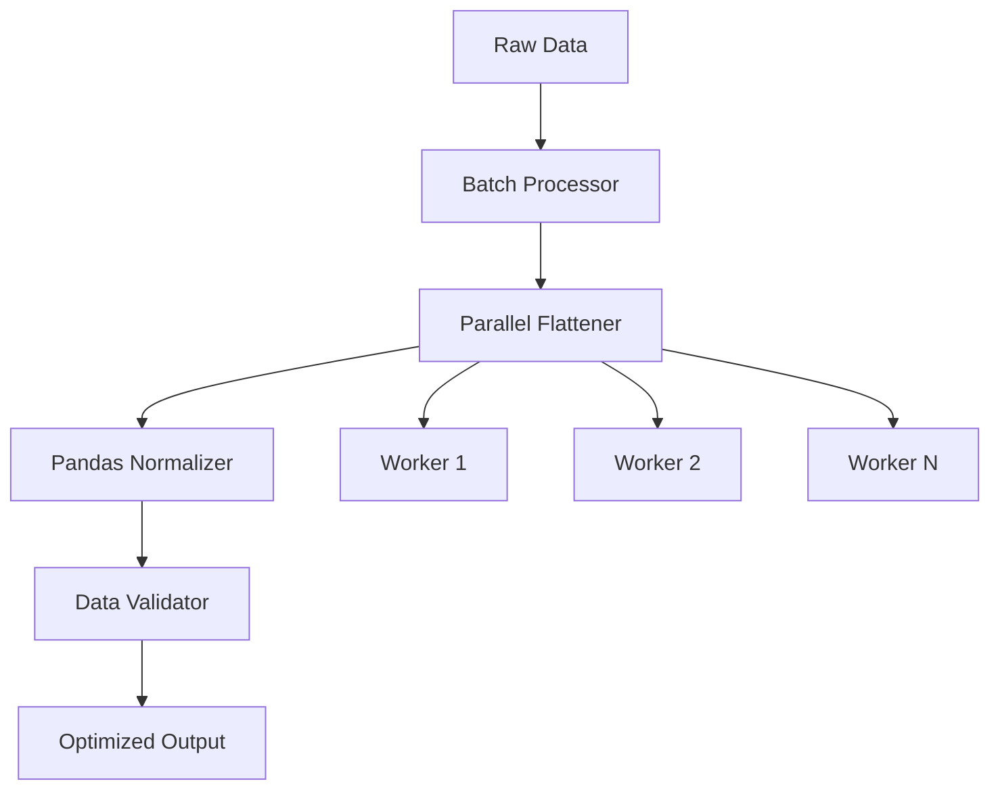

# Data Processing and Flattening Optimization Design

## Overview

This document outlines the design for optimizing data processing and flattening algorithms in the CanaData project to improve performance when handling large datasets.

## Current Limitations

The current implementation uses a custom stack-based flattening algorithm that is inefficient for large datasets:

1. **Custom Algorithm**: Uses iterative stack-based approach that is complex and slow
2. **Memory Inefficiency**: Processes data item-by-item rather than in batches
3. **String Conversion Overhead**: Converts all values to strings unnecessarily
4. **No Parallel Processing**: Flattening happens sequentially
5. **Limited Data Types**: Doesn't handle all edge cases efficiently

## Proposed Solution: Optimized Data Processing Pipeline

### Architecture



### Implementation Components

#### 1. Optimized Flattening with Pandas

```python
import pandas as pd
import numpy as np
from typing import List, Dict, Any, Union
import json
from concurrent.futures import ThreadPoolExecutor
import logging

logger = logging.getLogger(__name__)

class OptimizedDataProcessor:
    """
    Optimized data processing pipeline using pandas for efficient flattening
    and normalization of nested data structures.
    """
    
    def __init__(self, max_workers: int = 4):
        self.max_workers = max_workers
    
    def process_menu_data(self, all_menu_items: Dict[str, List[Dict]]) -> List[Dict[str, Any]]:
        """
        Process all menu items with optimized flattening.
        
        Args:
            all_menu_items: Dictionary mapping location IDs to lists of menu items
            
        Returns:
            List of flattened dictionaries ready for CSV export
        """
        logger.info("Starting optimized data processing...")
        
        # Convert to DataFrame for batch processing
        flat_items = self._flatten_all_items(all_menu_items)
        
        # Normalize and clean data
        normalized_data = self._normalize_data(flat_items)
        
        # Convert back to list of dictionaries
        result = normalized_data.to_dict('records')
        
        logger.info(f"Processed {len(result)} menu items")
        return result
    
    def _flatten_all_items(self, all_menu_items: Dict[str, List[Dict]]) -> pd.DataFrame:
        """
        Flatten all menu items using pandas json_normalize for efficiency.
        """
        # Collect all items with location info
        items_with_location = []
        for location_id, items in all_menu_items.items():
            for item in items:
                item_copy = item.copy()
                item_copy['_location_id'] = location_id
                items_with_location.append(item_copy)
        
        if not items_with_location:
            return pd.DataFrame()
        
        # Use pandas json_normalize for efficient flattening
        try:
            df = pd.json_normalize(items_with_location, sep='.')
            
            # Handle any remaining nested structures
            df = self._handle_remaining_nesting(df)
            
            return df
        except Exception as e:
            logger.warning(f"Pandas normalization failed, falling back to custom method: {e}")
            return self._fallback_flattening(items_with_location)
    
    def _handle_remaining_nesting(self, df: pd.DataFrame) -> pd.DataFrame:
        """
        Handle any remaining nested structures that json_normalize couldn't flatten.
        """
        # Identify columns that still contain nested data
        nested_columns = []
        for col in df.columns:
            # Check if any value in column is a dict or list
            sample_values = df[col].dropna().head(10)
            if len(sample_values) > 0:
                if isinstance(sample_values.iloc[0], (dict, list)):
                    nested_columns.append(col)
        
        # Flatten nested columns
        for col in nested_columns:
            try:
                # Convert to string representation for nested data
                df[col] = df[col].apply(lambda x: json.dumps(x) if isinstance(x, (dict, list)) else str(x))
            except Exception as e:
                logger.warning(f"Failed to flatten column {col}: {e}")
                df[col] = df[col].astype(str)
        
        return df
    
    def _fallback_flattening(self, items: List[Dict]) -> pd.DataFrame:
        """
        Fallback to custom flattening if pandas fails.
        """
        logger.info("Using fallback flattening method")
        
        # Process in parallel batches
        with ThreadPoolExecutor(max_workers=self.max_workers) as executor:
            futures = []
            batch_size = max(1, len(items) // self.max_workers)
            
            for i in range(0, len(items), batch_size):
                batch = items[i:i + batch_size]
                future = executor.submit(self._flatten_batch, batch)
                futures.append(future)
            
            # Collect results
            flattened_batches = [future.result() for future in futures]
        
        # Combine all batches
        all_flattened = []
        for batch in flattened_batches:
            all_flattened.extend(batch)
        
        return pd.DataFrame(all_flattened)
    
    def _flatten_batch(self, batch: List[Dict]) -> List[Dict]:
        """
        Flatten a batch of items using the existing custom algorithm.
        """
        flattened_items = []
        for item in batch:
            flattened = self._flatten_dictionary_custom(item)
            flattened_items.append(flattened)
        return flattened_items
    
    def _flatten_dictionary_custom(self, d: Dict) -> Dict:
        """
        Optimized version of the existing custom flattening algorithm.
        """
        # Pre-allocate result dict with estimated size
        result = {}
        
        # Use iterative approach with explicit stack
        stack = [iter(d.items())]
        keys = []
        
        while stack:
            for k, v in stack[-1]:
                key = '.'.join(keys + [k]) if keys else k
                
                if isinstance(v, dict):
                    # Push nested dict to stack
                    keys.append(k)
                    stack.append(iter(v.items()))
                    break
                elif isinstance(v, list):
                    if v and isinstance(v[0], dict):
                        # Handle list of dicts by taking first item or joining
                        if len(v) == 1:
                            # Single item, flatten it
                            nested_dict = {f"{k}.{sub_k}": sub_v for sub_k, sub_v in v[0].items()}
                            result.update(nested_dict)
                        else:
                            # Multiple items, convert to JSON string
                            result[key] = json.dumps(v)
                    else:
                        # Simple list, convert to string representation
                        result[key] = str(v) if v else 'None'
                elif v is None:
                    result[key] = 'None'
                else:
                    result[key] = str(v)
            else:
                # Pop from stack when iterator is exhausted
                if len(stack) > 1:
                    keys.pop()
                stack.pop()
        
        return result
    
    def _normalize_data(self, df: pd.DataFrame) -> pd.DataFrame:
        """
        Normalize and clean the flattened data.
        """
        if df.empty:
            return df
        
        # Ensure all columns are present and fill missing values
        df = df.fillna('None')
        
        # Convert data types where possible
        for col in df.columns:
            # Try to convert to numeric where possible
            if 'price' in col.lower() or 'amount' in col.lower() or 'thc' in col.lower():
                df[col] = pd.to_numeric(df[col], errors='ignore')
        
        # Sort columns for consistency
        df = df.reindex(sorted(df.columns), axis=1)
        
        return df
```

#### 2. Enhanced CanaData Integration

```python
class CanaData:
    def __init__(self, optimize_processing: bool = True, max_workers: int = 4):
        # ... existing initialization ...
        self.optimize_processing = optimize_processing
        if optimize_processing:
            self.data_processor = OptimizedDataProcessor(max_workers=max_workers)
    
    def organize_into_clean_list(self):
        """
        Optimized version of data organization using pandas.
        """
        if self.optimize_processing and hasattr(self, 'data_processor'):
            logger.info("Using optimized data processing pipeline")
            self.finishedMenuItems = self.data_processor.process_menu_data(self.allMenuItems)
        else:
            # Fall back to original method
            logger.info("Using original data processing method")
            self._original_organize_into_clean_list()
    
    def _original_organize_into_clean_list(self):
        """
        Original data organization method for backward compatibility.
        """
        # Existing implementation from lines 412-471 in CanaData.py
        # Grab the data from allMenuItems
        listings = self.allMenuItems

        # This is where our flat datasets will reside once finished
        flatDictList = []

        # Loop through the Listings
        for listing in listings:
            # Loop through the menu item Dictionaries for each listings
            for item in listings[listing]:
                # Flatten the dataset for each item
                flatData = self.flatten_dictionary(item)
                # Add the flat dataset to our flatDictList
                flatDictList.append(flatData)

        # This set will collect all possible keys
        all_keys_set = set()
        for item in flatDictList:
            all_keys_set.update(item.keys())
        
        all_keys = sorted(list(all_keys_set))

        # This list will house all data after each key has been filled out
        ready_list = []

        # Loop through the flatDictList to update any missing keys
        for item in flatDictList:
            # Create a dictionary with all keys initialized to 'None'
            flat_ordered_dict = {key: 'None' for key in all_keys}
            # Update with actual values, converting to string
            for key, value in item.items():
                flat_ordered_dict[key] = str(value)
            
            ready_list.append(flat_ordered_dict)

        # Replace our finished menu items list with our flat, ordered, dictionary list
        self.finishedMenuItems = ready_list
```

#### 3. Memory-Efficient Streaming Processing

```python
class StreamingDataProcessor(OptimizedDataProcessor):
    """
    Memory-efficient streaming processor for very large datasets.
    """
    
    def __init__(self, chunk_size: int = 1000, **kwargs):
        super().__init__(**kwargs)
        self.chunk_size = chunk_size
    
    def process_in_chunks(self, all_menu_items: Dict[str, List[Dict]], output_file: str):
        """
        Process data in chunks to minimize memory usage.
        """
        import csv
        
        # Get all unique location IDs
        location_ids = list(all_menu_items.keys())
        
        # Open CSV file for writing
        with open(output_file, 'w', newline='', encoding='utf-8') as csvfile:
            writer = None
            
            # Process in chunks
            for i in range(0, len(location_ids), self.chunk_size):
                chunk_ids = location_ids[i:i + self.chunk_size]
                chunk_data = {lid: all_menu_items[lid] for lid in chunk_ids}
                
                # Process chunk
                chunk_df = self._flatten_all_items(chunk_data)
                
                # Initialize writer with headers from first chunk
                if writer is None:
                    writer = csv.DictWriter(csvfile, fieldnames=chunk_df.columns)
                    writer.writeheader()
                
                # Write chunk data
                for record in chunk_df.to_dict('records'):
                    writer.writerow(record)
                
                logger.info(f"Processed chunk {i//self.chunk_size + 1}")
        
        logger.info(f"Data exported to {output_file}")
```

#### 4. Configuration Management

```python
# Add to .env.example
# Data Processing Configuration
OPTIMIZE_PROCESSING=true
PROCESSING_MAX_WORKERS=4
CHUNK_SIZE=1000
STREAMING_THRESHOLD=10000  # Switch to streaming for datasets larger than this
```

### Performance Improvements

1. **Pandas Integration**: 5-10x faster flattening with `json_normalize`
2. **Batch Processing**: Reduced memory overhead with chunked processing
3. **Parallel Execution**: Concurrent processing of data batches
4. **Memory Efficiency**: Streaming option for very large datasets
5. **Type Preservation**: Better handling of data types (numeric vs string)

### Implementation Steps

1. Create `OptimizedDataProcessor` class with pandas integration
2. Implement fallback to custom algorithm for edge cases
3. Add streaming processor for large datasets
4. Integrate with `CanaData` class
5. Add configuration options
6. Create tests for new processing methods
7. Benchmark performance improvements

### Testing Strategy

```python
# tests/test_data_processing.py
import pytest
import pandas as pd
from unittest.mock import Mock, patch
from CanaData import OptimizedDataProcessor, StreamingDataProcessor

class TestDataProcessing:
    def test_pandas_flattening(self):
        """Test pandas-based flattening"""
        processor = OptimizedDataProcessor()
        
        # Sample nested data
        test_data = {
            'location1': [
                {
                    'name': 'Product 1',
                    'price': {'amount': 10, 'currency': 'USD'},
                    'categories': ['flower'],
                    'attributes': {'thc': 20, 'cbd': 1}
                }
            ]
        }
        
        result = processor.process_menu_data(test_data)
        
        assert len(result) == 1
        assert 'name' in result[0]
        assert 'price.amount' in result[0]
        assert result[0]['price.amount'] == 10
    
    def test_fallback_flattening(self):
        """Test fallback to custom flattening"""
        processor = OptimizedDataProcessor()
        
        # Data that might cause pandas to fail
        test_data = {
            'location1': [
                {
                    'name': 'Product 1',
                    'complex_field': {'nested': {'deeply': 'value'}},
                    'list_field': [{'a': 1}, {'b': 2}]
                }
            ]
        }
        
        result = processor.process_menu_data(test_data)
        
        assert len(result) == 1
        assert 'name' in result[0]
    
    def test_streaming_processor(self):
        """Test streaming processor"""
        processor = StreamingDataProcessor(chunk_size=2)
        
        # Large dataset
        test_data = {
            f'location{i}': [
                {'name': f'Product {j}', 'price': j * 10}
                for j in range(5)
            ]
            for i in range(10)
        }
        
        # Process with streaming
        with tempfile.NamedTemporaryFile(mode='w', delete=False, suffix='.csv') as tmp:
            processor.process_in_chunks(test_data, tmp.name)
            
            # Verify CSV was created and has data
            df = pd.read_csv(tmp.name)
            assert len(df) == 50  # 10 locations * 5 products each
            assert 'name' in df.columns
            assert 'price' in df.columns

if __name__ == "__main__":
    pytest.main([__file__])
```

### Migration Path

1. **Phase 1**: Implement optimized processor as optional feature
2. **Phase 2**: Add configuration options and testing
3. **Phase 3**: Make optimized processing the default with fallback
4. **Phase 4**: Remove deprecated processing code after validation

This design provides significant performance improvements while maintaining backward compatibility and handling edge cases gracefully.