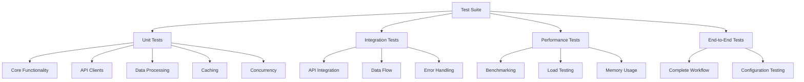

# Comprehensive Testing Strategy

## Overview

This document outlines a comprehensive testing strategy for the CanaData project to ensure reliability, performance, and maintainability of the enhanced architecture with concurrent fetching, caching, and optimized data processing.

## Current Testing State

The project currently has basic unit tests:
- `tests/test_canadata.py` - Tests for flattening functions
- `tests/test_api.py` - Tests for API clients with mocking

However, it lacks:
- Integration tests for the complete workflow
- Performance benchmarking
- Edge case coverage
- Comprehensive error handling tests
- Testing for new features (caching, concurrency)

## Proposed Testing Architecture

### Test Organization Structure



### Testing Framework Enhancements

#### 1. Enhanced Unit Test Structure

```python
# tests/test_unit_comprehensive.py
import pytest
import tempfile
import json
from unittest.mock import Mock, patch, MagicMock
from pathlib import Path

# Core functionality tests
class TestCanaDataCore:
    """Test core CanaData functionality"""
    
    def test_initialization(self, canadata_instance):
        """Test CanaData initialization"""
        assert canadata_instance.baseUrl is not None
        assert canadata_instance.pageSize == "&page_size=100&size=100"
        assert canadata_instance.locations == []
    
    def test_do_request_success(self, canadata_instance, mock_requests):
        """Test successful API request"""
        mock_response = Mock()
        mock_response.status_code = 200
        mock_response.json.return_value = {"data": "test"}
        mock_requests.get.return_value = mock_response
        
        result = canadata_instance.do_request("http://test.com")
        assert result == {"data": "test"}
    
    def test_do_request_validation_error(self, canadata_instance, mock_requests):
        """Test validation error handling (422)"""
        mock_response = Mock()
        mock_response.status_code = 422
        mock_response.text = "Validation failed"
        mock_response.json.return_value = {"errors": [{"detail": "Invalid parameter"}]}
        mock_requests.get.return_value = mock_response
        
        result = canadata_instance.do_request("http://test.com")
        assert result == 'break'
    
    def test_do_request_other_error(self, canadata_instance, mock_requests):
        """Test other error handling"""
        mock_response = Mock()
        mock_response.status_code = 500
        mock_response.text = "Internal Server Error"
        mock_requests.get.return_value = mock_response
        
        result = canadata_instance.do_request("http://test.com")
        assert result is False

# API Client Tests
class TestCannMenusClient:
    """Test CannMenus API client"""
    
    def test_get_retailers_success(self, cannmenus_client, mock_requests):
        """Test successful retailer retrieval"""
        mock_response = Mock()
        mock_response.status_code = 200
        mock_response.json.return_value = {
            "data": [{"id": "shop-1", "name": "Test Dispensary"}]
        }
        mock_requests.get.return_value = mock_response
        
        retailers = cannmenus_client.get_retailers("NY")
        assert len(retailers) == 1
        assert retailers[0]["name"] == "Test Dispensary"
    
    def test_get_retailers_missing_token(self, monkeypatch):
        """Test behavior with missing API token"""
        monkeypatch.delenv("CANNMENUS_API_TOKEN", raising=False)
        client = CannMenusClient()
        retailers = client.get_retailers("NY")
        assert retailers == []

# Data Processing Tests
class TestOptimizedDataProcessor:
    """Test optimized data processing"""
    
    def test_pandas_flattening(self, optimized_processor):
        """Test pandas-based flattening"""
        test_data = {
            "location1": [{
                "name": "Product 1",
                "price": {"amount": 10, "currency": "USD"},
                "categories": ["flower"]
            }]
        }
        
        result = optimized_processor.process_menu_data(test_data)
        assert len(result) == 1
        assert result[0]["name"] == "Product 1"
        assert result[0]["price.amount"] == 10
    
    def test_edge_case_handling(self, optimized_processor):
        """Test handling of edge cases"""
        test_data = {
            "location1": [{
                "name": "Complex Product",
                "nested_dict": {"deep": {"value": "test"}},
                "list_of_dicts": [{"a": 1}, {"b": 2}],
                "empty_list": [],
                "none_value": None
            }]
        }
        
        result = optimized_processor.process_menu_data(test_data)
        assert len(result) == 1
        assert "nested_dict.deep.value" in result[0]
        assert "list_of_dicts" in result[0]

# Caching Tests
class TestCacheManager:
    """Test caching functionality"""
    
    def test_memory_cache_hit(self, cache_manager):
        """Test memory cache hit"""
        cache_manager.set("test_url", {"data": "cached_value"})
        result = cache_manager.get("test_url")
        assert result == {"data": "cached_value"}
        assert cache_manager.stats["memory_hits"] == 1
    
    def test_disk_cache_persistence(self, temp_cache_dir):
        """Test disk cache persistence"""
        cache_manager = CacheManager(cache_dir=temp_cache_dir)
        cache_manager.set("persistent_url", {"data": "persistent_value"})
        
        # Create new instance to simulate restart
        new_cache_manager = CacheManager(cache_dir=temp_cache_dir)
        result = new_cache_manager.get("persistent_url")
        assert result == {"data": "persistent_value"}
    
    def test_cache_expiration(self, cache_manager):
        """Test cache expiration"""
        # Create cache with short TTL
        short_ttl_cache = CacheManager(memory_cache_ttl=0.1)
        short_ttl_cache.set("expiring_url", {"data": "expiring_value"})
        
        # Wait for expiration
        import time
        time.sleep(0.2)
        
        result = short_ttl_cache.get("expiring_url")
        assert result is None

# Concurrency Tests
class TestConcurrentMenuProcessor:
    """Test concurrent processing"""
    
    def test_concurrent_processing(self, concurrent_processor):
        """Test concurrent location processing"""
        locations = [{"slug": f"test-{i}", "type": "dispensary"} for i in range(5)]
        
        def mock_process_func(location):
            return {"items": [f"item-{location['slug']}"]}
        
        results = concurrent_processor.process_locations(locations, mock_process_func)
        assert len(results) == 5
        assert all("items" in result for result in results.values())
    
    def test_error_handling(self, concurrent_processor):
        """Test error handling in concurrent processing"""
        locations = [
            {"slug": "good-location", "type": "dispensary"},
            {"slug": "bad-location", "type": "dispensary"}
        ]
        
        def mock_process_func(location):
            if location["slug"] == "bad-location":
                raise Exception("Test error")
            return {"items": [f"item-{location['slug']}"]}
        
        results = concurrent_processor.process_locations(locations, mock_process_func)
        assert len(results) == 1  # Only good location should succeed
        assert len(concurrent_processor.errors) == 1  # One error should be recorded
```

#### 2. Integration Test Suite

```python
# tests/test_integration.py
import pytest
import responses
import tempfile
from unittest.mock import patch
from CanaData import CanaData
from CannMenusClient import CannMenusClient
from LeaflyScraper import scrape_leafly

class TestIntegration:
    """Integration tests for complete workflows"""
    
    @responses.activate
    def test_complete_weedmaps_workflow(self, canadata_instance):
        """Test complete Weedmaps scraping workflow"""
        # Mock locations API response
        locations_url = "https://api-g.weedmaps.com/discovery/v1/listings?offset=0&page_size=100&size=100&filter[any_retailer_services][]=storefront&filter[region_slug[dispensaries]]=test-city"
        locations_response = {
            "meta": {"total_listings": 2},
            "data": {
                "listings": [
                    {"slug": "dispensary-1", "type": "dispensary"},
                    {"slug": "dispensary-2", "type": "dispensary"}
                ]
            }
        }
        responses.add(responses.GET, locations_url, json=locations_response, status=200)
        
        # Mock menu API responses
        menu_url_1 = "https://weedmaps.com/api/web/v1/listings/dispensary-1/menu?type=dispensary"
        menu_response_1 = {
            "categories": [{
                "title": "Flower",
                "items": [{"name": "Blue Dream", "price": {"amount": 50}}]
            }]
        }
        responses.add(responses.GET, menu_url_1, json=menu_response_1, status=200)
        
        menu_url_2 = "https://weedmaps.com/api/web/v1/listings/dispensary-2/menu?type=dispensary"
        menu_response_2 = {
            "categories": [{
                "title": "Concentrates",
                "items": [{"name": "OG Kush Hash", "price": {"amount": 40}}]
            }]
        }
        responses.add(responses.GET, menu_url_2, json=menu_response_2, status=200)
        
        # Run the workflow
        canadata_instance.searchSlug = "test-city"
        canadata_instance.storefronts = True
        canadata_instance.deliveries = False
        
        canadata_instance.getLocations()
        canadata_instance.getMenus()
        canadata_instance.organize_into_clean_list()
        
        # Verify results
        assert len(canadata_instance.locations) == 2
        assert len(canadata_instance.finishedMenuItems) == 2
        assert canadata_instance.finishedMenuItems[0]["name"] in ["Blue Dream", "OG Kush Hash"]
    
    @responses.activate
    def test_cannmenus_integration(self, canadata_instance, monkeypatch):
        """Test CannMenus integration"""
        # Mock environment
        monkeypatch.setenv("CANNMENUS_API_TOKEN", "test-token")
        
        # Mock retailers API
        retailers_url = "https://api.cannmenus.com/v1/retailers?state=CA"
        retailers_response = {
            "data": [
                {"id": "retailer-1", "name": "California Dispensary", "slug": "california-dispensary"}
            ]
        }
        responses.add(responses.GET, retailers_url, json=retailers_response, status=200)
        
        # Mock menu API
        menu_url = "https://api.cannmenus.com/v1/retailers/retailer-1/menu"
        menu_response = {
            "data": [
                {"name": "Northern Lights", "price": 45}
            ]
        }
        responses.add(responses.GET, menu_url, json=menu_response, status=200)
        
        # Run CannMenus integration
        canadata_instance.integrateCannMenus(["CA"])
        
        # Verify results
        assert len(canadata_instance.allMenuItems) == 1
        assert "retailer-1" in canadata_instance.allMenuItems
        assert len(canadata_instance.allMenuItems["retailer-1"]) == 1
    
    @patch('LeaflyScraper.ApifyClient')
    def test_leafly_integration(self, mock_apify_client, canadata_instance):
        """Test Leafly integration"""
        # Mock Apify client
        mock_actor_call = Mock()
        mock_actor_call.wait_for_finish.return_value.get.return_value = {
            "items": [
                {"name": "Sour Diesel", "price": 55, "type": "flower"}
            ]
        }
        mock_client_instance = Mock()
        mock_client_instance.actor.return_value.call.return_value = mock_actor_call
        mock_apify_client.return_value = mock_client_instance
        
        # Mock environment
        with patch.dict('os.environ', {'APIFY_TOKEN': 'test-token'}):
            result = scrape_leafly("san-francisco")
            
            # Verify results
            assert len(result) == 1
            assert result[0]["name"] == "Sour Diesel"
```

#### 3. Performance Benchmarking Tests

```python
# tests/test_performance.py
import pytest
import time
import tempfile
from unittest.mock import Mock, patch
import pandas as pd
from memory_profiler import profile

class TestPerformance:
    """Performance and benchmarking tests"""
    
    def test_concurrent_vs_sequential_processing(self, canadata_instance):
        """Benchmark concurrent vs sequential processing"""
        # Generate test data
        locations = [{"slug": f"test-{i}", "type": "dispensary"} for i in range(20)]
        
        # Mock processing function
        def mock_process(location):
            time.sleep(0.1)  # Simulate network delay
            return {"items": [f"item-{location['slug']}"]}
        
        # Test sequential processing
        start_time = time.time()
        results_sequential = []
        for location in locations[:5]:  # Test with smaller set
            results_sequential.append(mock_process(location))
        sequential_time = time.time() - start_time
        
        # Test concurrent processing
        start_time = time.time()
        concurrent_processor = ConcurrentMenuProcessor(max_workers=5)
        results_concurrent = concurrent_processor.process_locations(
            locations[:5], 
            mock_process
        )
        concurrent_time = time.time() - start_time
        
        # Concurrent should be faster
        assert concurrent_time < sequential_time
        print(f"Sequential time: {sequential_time:.2f}s")
        print(f"Concurrent time: {concurrent_time:.2f}s")
        print(f"Speedup: {sequential_time/concurrent_time:.2f}x")
    
    @profile
    def test_memory_usage_data_processing(self, optimized_processor):
        """Test memory usage of data processing"""
        # Generate large dataset
        large_dataset = {
            f"location-{i}": [
                {
                    "name": f"Product-{j}",
                    "price": {"amount": j, "currency": "USD"},
                    "categories": ["flower", "indica", "test"],
                    "attributes": {f"attr-{k}": k for k in range(10)}
                }
                for j in range(100)
            ]
            for i in range(50)
        }
        
        # Process the data
        result = optimized_processor.process_menu_data(large_dataset)
        
        # Should process 5000 items
        assert len(result) == 5000
    
    def test_cache_performance_benefit(self, cache_manager):
        """Test performance benefit of caching"""
        # Test without cache
        start_time = time.time()
        for i in range(100):
            # Simulate API call
            time.sleep(0.01)
            result = {"data": f"value-{i}"}
        no_cache_time = time.time() - start_time
        
        # Test with cache
        start_time = time.time()
        for i in range(100):
            cache_key = f"url-{i}"
            cached_result = cache_manager.get(cache_key)
            if cached_result is None:
                # Simulate API call
                time.sleep(0.01)
                result = {"data": f"value-{i}"}
                cache_manager.set(cache_key, result)
                cached_result = result
        cache_time = time.time() - start_time
        
        # Caching should be faster (after initial cache population)
        assert cache_time < no_cache_time * 2  # Allow some overhead for cache management
    
    def test_data_processing_scalability(self, optimized_processor):
        """Test data processing scalability"""
        sizes = [100, 500, 1000, 2000]
        times = []
        
        for size in sizes:
            # Generate test data of specific size
            test_data = {
                f"location-{i}": [
                    {"name": f"Product-{j}", "price": j}
                    for j in range(size // 100)
                ]
                for i in range(100)
            }
            
            start_time = time.time()
            result = optimized_processor.process_menu_data(test_data)
            processing_time = time.time() - start_time
            
            times.append(processing_time)
            print(f"Size {size}: {processing_time:.2f}s for {len(result)} items")
            
            # Verify all items processed
            assert len(result) == size
        
        # Check that time increases reasonably (should be roughly linear)
        # This is a simple check - in reality, growth might be sub-linear due to optimization
        assert times[-1] < times[0] * 25  # Not more than 25x slower for 20x more data
```

#### 4. Fixtures and Test Utilities

```python
# tests/conftest.py (enhanced)
import pytest
import tempfile
import os
from unittest.mock import Mock, patch
from CanaData import CanaData, CacheManager, ConcurrentMenuProcessor, OptimizedDataProcessor
from CannMenusClient import CannMenusClient

@pytest.fixture
def canadata_instance():
    """Create a CanaData instance for testing"""
    return CanaData()

@pytest.fixture
def cannmenus_client():
    """Create a CannMenusClient instance for testing"""
    return CannMenusClient()

@pytest.fixture
def cache_manager():
    """Create a CacheManager instance with temporary directory"""
    temp_dir = tempfile.mkdtemp()
    cache_mgr = CacheManager(cache_dir=temp_dir)
    yield cache_mgr
    # Cleanup
    import shutil
    shutil.rmtree(temp_dir, ignore_errors=True)

@pytest.fixture
def temp_cache_dir():
    """Create a temporary cache directory"""
    temp_dir = tempfile.mkdtemp()
    yield temp_dir
    import shutil
    shutil.rmtree(temp_dir, ignore_errors=True)

@pytest.fixture
def concurrent_processor():
    """Create a ConcurrentMenuProcessor instance"""
    return ConcurrentMenuProcessor(max_workers=3, rate_limit=0.1)

@pytest.fixture
def optimized_processor():
    """Create an OptimizedDataProcessor instance"""
    return OptimizedDataProcessor(max_workers=2)

@pytest.fixture
def mock_requests():
    """Mock requests library"""
    with patch('CanaData.requests') as mock_req:
        yield mock_req

@pytest.fixture
def mock_responses():
    """Mock responses for API testing"""
    with patch('tests.test_api.responses') as mock_resp:
        yield mock_resp

# Test data fixtures
@pytest.fixture
def sample_menu_data():
    """Sample menu data for testing"""
    return {
        "categories": [
            {
                "title": "Flower",
                "items": [
                    {
                        "name": "Blue Dream",
                        "price": {"amount": 50, "currency": "USD"},
                        "thc": 18,
                        "category": "flower"
                    },
                    {
                        "name": "OG Kush",
                        "price": {"amount": 55, "currency": "USD"},
                        "thc": 22,
                        "category": "flower"
                    }
                ]
            }
        ]
    }

@pytest.fixture
def sample_locations():
    """Sample locations data for testing"""
    return [
        {"slug": "dispensary-1", "type": "dispensary"},
        {"slug": "dispensary-2", "type": "dispensary"},
        {"slug": "delivery-1", "type": "delivery"}
    ]

# Property-based testing with hypothesis
@pytest.fixture
def hypothesis_settings():
    """Settings for hypothesis-based testing"""
    try:
        from hypothesis import settings
        return settings(max_examples=50, deadline=1000)
    except ImportError:
        return None
```

### Test Coverage Goals

1. **Unit Test Coverage**: 90%+ for core functionality
2. **Integration Test Coverage**: 80%+ for API interactions
3. **Edge Case Coverage**: 100% for error handling paths
4. **Performance Test Coverage**: Baseline benchmarks for all major operations

### Continuous Integration Setup

```yaml
# .github/workflows/test.yml
name: Tests
on: [push, pull_request]

jobs:
  test:
    runs-on: ubuntu-latest
    strategy:
      matrix:
        python-version: [3.8, 3.9, "3.10", "3.11"]
    
    steps:
    - uses: actions/checkout@v3
    
    - name: Set up Python ${{ matrix.python-version }}
      uses: actions/setup-python@v4
      with:
        python-version: ${{ matrix.python-version }}
    
    - name: Install dependencies
      run: |
        python -m pip install --upgrade pip
        pip install -r requirements.txt
        pip install pytest pytest-cov pytest-benchmark memory-profiler
    
    - name: Run tests with coverage
      run: |
        pytest --cov=CanaData --cov=CannMenusClient --cov=LeaflyScraper --cov-report=xml
    
    - name: Upload coverage to Codecov
      uses: codecov/codecov-action@v3
      with:
        file: ./coverage.xml
        flags: unittests
        name: codecov-umbrella
```

### Performance Monitoring

```python
# tests/benchmark_monitor.py
"""Performance benchmark monitoring"""
import time
import psutil
import os
from typing import Dict, Any

class PerformanceMonitor:
    """Monitor performance metrics during testing"""
    
    def __init__(self):
        self.metrics = {}
        self.start_time = None
        self.start_memory = None
    
    def start_monitoring(self):
        """Start performance monitoring"""
        self.start_time = time.time()
        self.start_memory = psutil.Process(os.getpid()).memory_info().rss
    
    def stop_monitoring(self, operation_name: str):
        """Stop performance monitoring and record metrics"""
        if self.start_time is None:
            return
        
        end_time = time.time()
        end_memory = psutil.Process(os.getpid()).memory_info().rss
        
        self.metrics[operation_name] = {
            'duration': end_time - self.start_time,
            'memory_used': end_memory - self.start_memory,
            'peak_memory': end_memory
        }
        
        self.start_time = None
        self.start_memory = None
    
    def get_metrics(self) -> Dict[str, Any]:
        """Get collected metrics"""
        return self.metrics.copy()
    
    def print_summary(self):
        """Print performance summary"""
        print("\n=== Performance Summary ===")
        for operation, metrics in self.metrics.items():
            print(f"{operation}:")
            print(f"  Duration: {metrics['duration']:.2f}s")
            print(f"  Memory Used: {metrics['memory_used'] / 1024 / 1024:.2f} MB")
            print(f"  Peak Memory: {metrics['peak_memory'] / 1024 / 1024:.2f} MB")
```

### Implementation Roadmap

1. **Phase 1**: Enhance existing test suite with better structure and coverage
2. **Phase 2**: Add integration tests for complete workflows
3. **Phase 3**: Implement performance benchmarking tests
4. **Phase 4**: Add property-based testing for edge cases
5. **Phase 5**: Set up CI/CD with automated testing and coverage reporting
6. **Phase 6**: Add monitoring and alerting for performance regressions

This comprehensive testing strategy ensures the reliability and performance of the enhanced CanaData architecture while providing confidence in future changes.